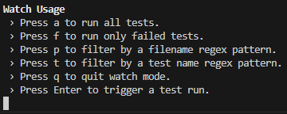

# Unit Testing with TypeScript and Jest

## Prerequisites

-   Fork the repository [`unit-testing-with-jest`](https://github.com/mcgill-a/unit-testing-with-jest/)
-   Clone your forked repo to download it
-   In a terminal, go to the root folder of the repo.
-   If you can run `npm` commands, great! Otherwise, please install [Node.js](https://nodejs.org/en)
-   Run `npm ci` to install the package dependencies (TypeScript, Jest etc.)

---

## What is Jest?

As per the [official Jest website](https://jestjs.io/):

> "Jest is a delightful JavaScript Testing Framework with a focus on simplicity. It works with projects using: Babel, TypeScript, Node, React, Angular, Vue and more!"

## What does an empty test file look like in jest?

```typescript
// used to group related tests together
describe('MyComponent', () => {
    // declaring the component that I want to test
    let component: MyComponent;

    // gets runs before each test case
    beforeEach(() => {
        // initialise (reset) the component
        component = new MyComponent();
    });

    // used to execute individual test cases
    it('should exist', () => {
        expect(component).toBeTruthy();
    });
});
```

## Some hot tips for using Jest:

It's probably best to use `.toEqual()` instead of `.toBe()`

-   `.toBe()` compares the object by reference (so it is only fine for primatives)
-   `.toEqual()` compares the objects by key/values (so should be your default as it works for pretty much anything...)

To explain what happens in the test, it is common practice to for each test name to start with "should".

-   For example: `"should correctly identify when the user is an admin"`

`it` is an alias for `test` - they do the same thing, but stick to one or the other!

Jest requires at least one test in the test file for it to run

-   This is why test files come with a default placeholder test
-   Once you've written a new test, you should delete the `"should exist"` test as it is redundant.

---

## How do I complete this workshop?

Below is a series of chapters relating to unit testing and code coverage
For each chapter, please:

-   Read the description
-   Look at the `"source code"` file
-   Look at the `"tests"` file
-   Update the unit tests (and sometimes source code 👀) to get 100% code coverage in the `"tests"` file

Pro tip: You can view this `README.md` file in VS Code using the right click file option `"Open Preview"`

---

## How do I actually run the unit tests?

There are two test runner commands in the [`package.json`](/package.json) file for this workshop.

If you know of another way to run the tests then feel free to do that, but if not, then you can't go wrong with:

```typescript
// run all tests once
npm run test
```

```typescript
// run all tests on save / with additional options (shown below)
npm run test:watch
```



[Click here to read more about Jest watch mode menu options](https://stephencharlesweiss.com/jest-watch-mode)

---

## Where can I find the code coverage report?

Jest has been setup to save a HTML code coverage report in a `coverage` folder.

-   This is added to the `.gitignore` file so isn't included in the repo. You'll have to run the tests to see it!
-   Once you've done that, you can find it here: [`./coverage/html/index.html`](/coverage/html/index.html)

Open this file in a web browser and you'll see a nicely formatted report where you can interact with the files to see more details.

-   You can right click on the file in VS code and `"Copy Path"` then paste it in the browser
-   You'll need to reload the page after re-running your tests, so don't worry if it hasn't updated 😅

---

# Chapters:

## A) Introduction

This section includes a class with some basic math functions.

Write some unit tests to make sure we get 100% code coverage on this source code, and **remember**:

-   Remove the placeholder `'should exist'` test
-   Use `.toEqual` where possible, not `.toBe` or `.toBeTruthy`!

Good luck! 😇

[source code](/src/a/component.ts) | [tests](/src/a/component.spec.ts)

---

## B) Hypothetically, how can I cheat the code coverage percentage?

Let's have a look at the code for this question and find out.

-   The test file here is no good - it does have 100% code coverage, but what is wrong with it?
-   It has 100% coverage and the test passes, but... it's obviously not useful

It's not ensuring that the functionality works as expected, it's just running it!

-   You might as well do `component.isAdmin; expect(1).toEqual(1);`
-   Please avoid doing this - future you will thank you 😅

Update the code, and make sure you account for each possible outcome

Side note: if you are not familar with getters and setters in TypeScript, [have a quick look at this](https://www.tutorialspoint.com/how-to-use-getters-and-setters-in-typescript)

[source code](/src/b/component.ts) | [tests](/src/b/component.spec.ts)

---

## C) My code will throw an error in some cases. How do I test this?

Test **both** cases:

-   Where you expect the function to throw ✅
-   Where you expect the function not to throw ✅

```typescript
expect(() => {...}).toThrow();
expect(() => {...}).not.toThrow();
```

[source code](/src/c/component.ts) | [tests](/src/c/component.spec.ts)

---

## D) How should you mock data in a unit test?

Here's a scenario:

-   You have a few unit tests that rely on the same set of mock data
-   One of the tests modifies the mock data
-   The other tests now fail because they relied on using the original data

How do you avoid this?

-   Make a function that returns a new object each time:

```typescript
describe('AnExample', () => {
    let user;

    beforeEach(() => {
        user = mockUser();
    });

    function mockUser(): User {
        return <User>{ id: 'foo', ... };
    }
});
```

-   This helps reduce noise in individual tests as well!

```typescript
describe('Something', () => {
    it('should demonstrate why mock functions are cleaner', () => {
        // making the object from scratch
        const something: Something = {
            somethingElse: 'foo',
            aFunction: jest.fn()
        }

        // VERSUS:

        // making it from a mock function!
        const something = mockSomething();

        component.init(something);
        expect()...
    })
})
```

Do I need to unit test the helper functions?

-   No! They're only used to recreate objects
-   They should not have any complex logic in them
-   They're meant to help reduce unit test repetitiveness, not make more!

Update the test file so that:

-   The data is reset between each test
-   It uses mock functions to setup mocks

[source code](/src/d/component.ts) | [tests](/src/d/component.spec.ts)

---

## E) How do I stop console logs from showing in my tests?

You should first consider - do the console logs need to be there?

-   If so, [mock them!](https://jest-bot.github.io/jest/docs/mock-functions.html) (and other features you don't care about in the tests)
-   We can leverage [`jest.spyOn`](https://jestjs.io/docs/jest-object#jestspyonobject-methodname) to do this, like so:

```typescript
jest.spyOn(console, 'log').mockImplementation(() => null);
```

-   We're replacing `console.log` with an empty function does nothing apart from returning null
-   What does that mean? No more logs in the test output!

[source code](/src/e/component.ts) | [tests](/src/e/component.spec.ts)

---

## F) What if I want to compare part of an object, not the whole thing?

[Have a look at what else you can do with `expect()`](https://jestjs.io/docs/expect#asymmetric-matchers) - quite a lot!

-   It's not just for checking if A equals B
-   For example, you can check _part_ of an object, using `expect().objectContaining({..})`

```typescript
const result = { hello: 'world', foo: 'bar' };
expect(result).toEqual(expect().objectContaining({ foo: 'bar' }));
```

For this question, let's not check the things we can't control (`id` and `date`)

-   Bonus points if you want to check and [mock the date](https://javascript.plainenglish.io/mock-js-dates-with-fake-timer-and-jest-7d20c6ab9bff) but definitely not required! ⭐
-   If you are going to mock the date, use a date from a long time ago (2000. for example)
-   This makes it very clear that the date is mocked and not to be confused with today!

[source code](/src/f/component.ts) | [tests](/src/f/component.spec.ts)

---

## G) What about a more realistic example of code that needs tested?

Here's a real world (_albeit simplified_) example of a [custom ag-grid column group header component](https://www.ag-grid.com/angular-data-grid/component-header/).

The component:

-   takes in some parameters in the `init` method
-   detects the display name of the column group
-   detects whether the column group is expanded
-   is able to toggle the column group expanded state

There's a few more moving parts here compared to the previous questions.

Let's see what you can do 💪

[source code](/src/g/component.ts) | [tests](/src/g/component.spec.ts)

---

## H) How do I mock an imported class / service?

Why do we have a service in the first place?

-   We want to isolate our complex, reusable logic
-   Individual components shouldn't have to care how it works, just that it's taken care of 🙂

We can mock service functionality by initialising the service with jest mock functions and variables

-   Look out for the `Partial<>` syntax here. It's some TypeScript magic that makes all the properties of our object optional. This means we don't have to mock everything in the service if we don't want to!
-   Keep in mind that the consumers of the service are still expecting the 'full' service, so we cast the `Partial` service using `<ExampleService>exampleService`, making it think it's the real deal.
-   In TypeScript, this is known as [type casting](https://www.typescripttutorial.net/typescript-tutorial/type-casting/).

Here's an example to help get you started with mocking a service:

```typescript
let example: Example;
let exampleService: Partial<ExampleService>;

beforeEach(() => {
    exampleValue = 'foo';
    exampleService = {
        doExampleThing: jest.fn(), // a jest mock function
        get example() {
            // example is a getter, so use the `get example() {..}` syntax
            return exampleValue;
        }
    };
    component = new Example(<ExampleService>exampleService);
});
```

-   We can check that these functions are called in our `expect` like this:

```typescript
expect(accountService.doExampleThing).toHaveBeenCalledWith('something');
```

-   We can mock the return value of our service using `.mockReturnValue`, or `.mockReturnValueOnce` (preferred), like this:

```typescript
jest.spyOn(accountService, 'example').mockReturnValueOnce('foo');
```

If we put that all together, we get this:

```typescript
// service
export class ExampleService() {
    public get example(): string {
        return 'example';
    }

    public doExampleThing(value: string): void {
        console.log(value);
    }

}

// component
export class Example {
    constructor (private exampleService: ExampleService) {}

    public get example(): string {
        return this.exampleService.example;
    }

    public exampleThing(value: string): void {
        this.exampleService.doExampleThing(value);
    }
}

// component tests
it('should get example from our service', () => {
    jest.spyOn(exampleService, 'example', 'get').mockReturnValueOnce('example');
    expect(component.example).toEqual('example');
})

it('should call the example service on exampleThing', () => {
    component.exampleThing('foo');
    expect(exampleService.doExampleThing).toHaveBeenCalledWith('foo');
})

```

[source code](/src/h/component.ts) | [tests](/src/h/component.spec.ts)

---

## In conclusion

-   100% code coverage is cool
-   We can leverage `spyOn` and mock functions ( `jest.fn()` ) to:
    -   Mock functionality
    -   Check whether things have been called
-   We don't test what imported services actually do, just that we've asked them to do something
    -   If we want to test that a service is working properly, we write unit tests for that too!
-   This is what unit testing is all about - breaking your tests up into small, isolated units of testable logic 💯

---

## Thank you!
